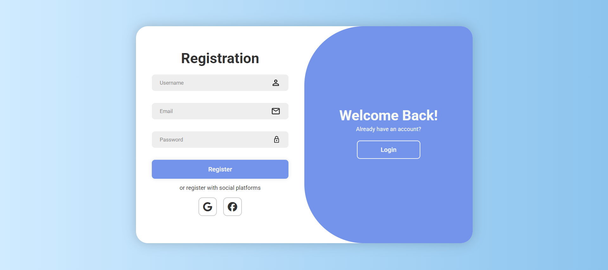
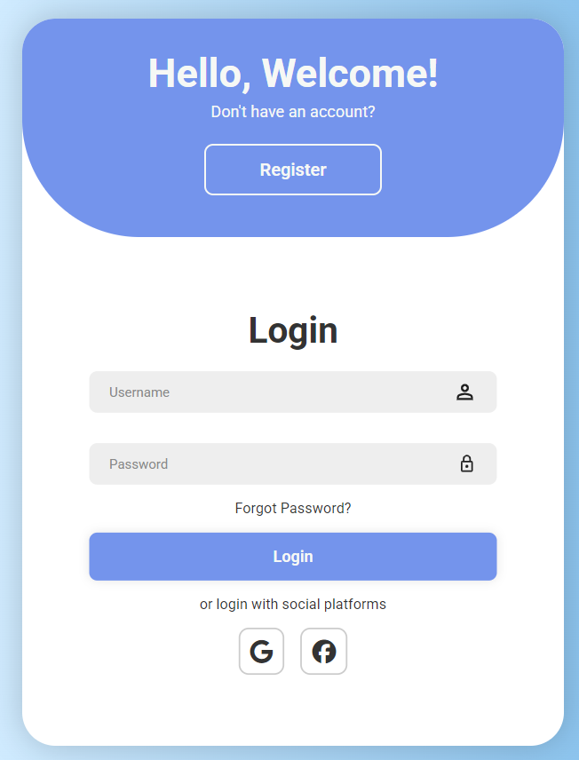
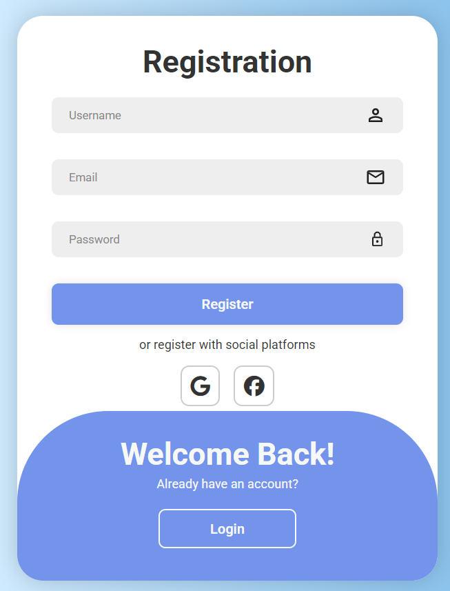

# Signin-Login-Template

This is a responsive sliding signin and login template programmed with html, css, and basic javascript.

## 🛠 Tech Stack
- HTML, CSS, Basic Javascript.
  
## 📌 Notes
- This is a learning project based on a Youtube tutorial of Codehal.

## 📚 Reference
- Codehal tutorial: https://youtu.be/Z_AbWH-Vyl8?si=xLTHX8g8Fit3IB0Z

## Images
- Login Desktop View

- Register Desktop View

- Login Mobile View

- Register Mobile View

